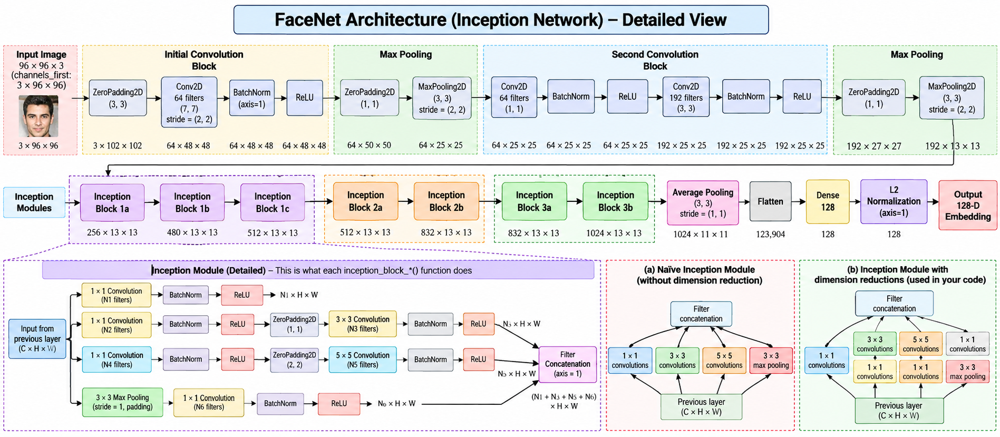
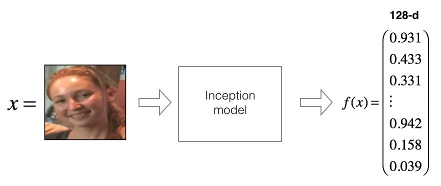
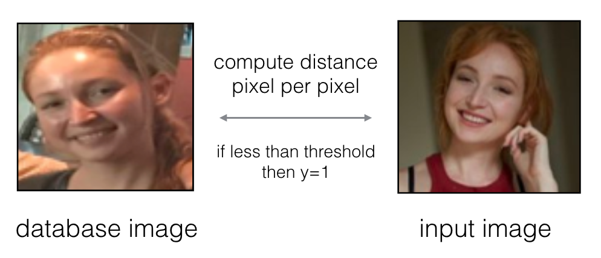
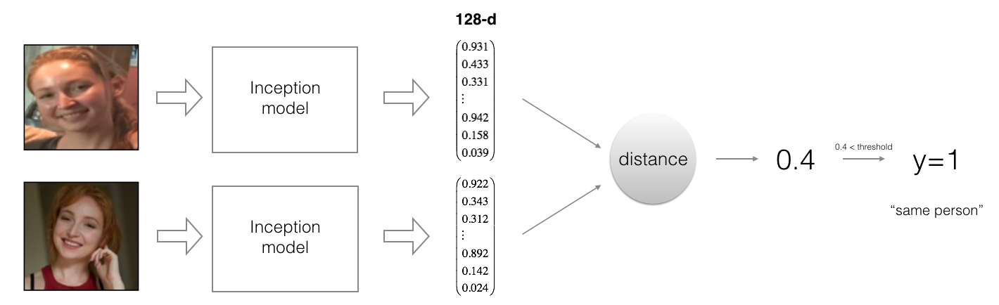
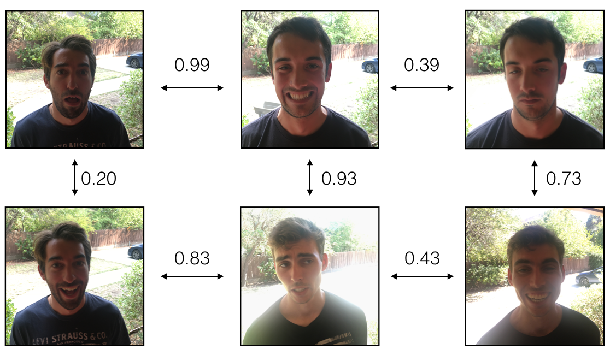
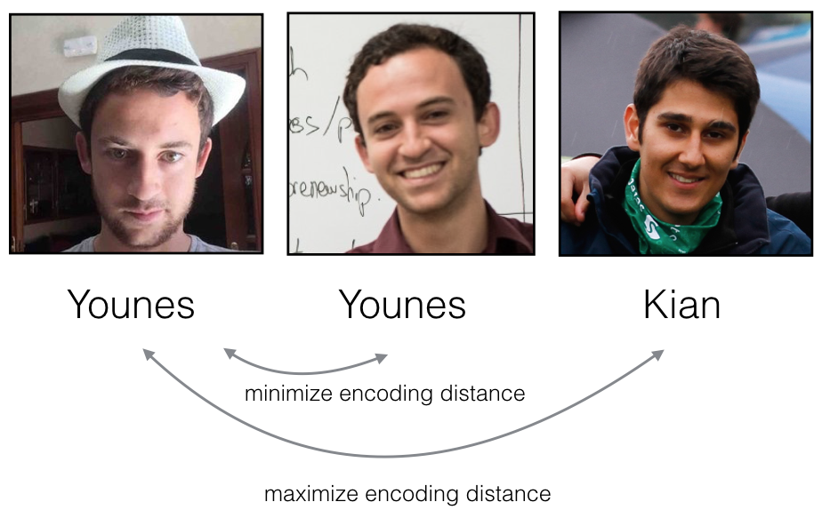
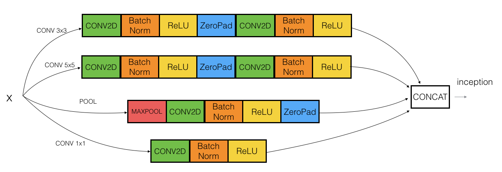

# Face Recognition with FaceNet and 128-Dimensional Face Embeddings


## 📌 Project Overview

This project implements a **face recognition pipeline based on FaceNet-style face embeddings** using TensorFlow and Keras.

Instead of comparing face images directly at the pixel level, the system converts each face image into a **128-dimensional embedding vector**. Face verification and recognition are then performed by measuring the **L2 distance** between embeddings.

The project covers the workflow:

**Face Image → Preprocessing → 128-D Embedding → L2 Distance → Verification / Recognition**

The notebook also implements the **triplet loss** used to train FaceNet-style embedding models, while the actual recognition workflow uses a pretrained model because training FaceNet from scratch requires substantial data and computation.

---

## 🎯 Motivation

The goal of this project was to understand what happens inside a face-recognition system instead of treating the model as a black box.

The project explores:

- Why direct pixel-to-pixel comparison is unreliable.
- How a CNN converts a face into a compact vector representation.
- How **triplet loss** separates embeddings of different people.
- How the same embedding supports **1:1 face verification** and **1:K face recognition**.
- How distance thresholds can turn similarity measurements into identity decisions.

---

## 🧠 What Problem Does It Solve?

### Face Verification — 1:1

Given an image and a claimed identity, the system compares the query embedding with the stored embedding for that identity.

```text
Query Image
     ↓
128-D Embedding
     ↓
Compare with Stored Embedding
     ↓
L2 Distance
     ↓
Distance < 0.7 ?
   ↙       ↘
 Yes       No
 Match   No Match
```

### Face Recognition — 1:K

Instead of receiving a claimed identity, the system compares the input embedding with every embedding in the database and selects the identity with the smallest L2 distance.

```text
Query Image → 128-D Embedding
                    ↓
          Compare with database
          ↙       ↓       ↘
       Person A Person B  Person K
                    ↓
             Smallest distance
                    ↓
                Identity
```

---

# ✨ Key Features

- Face image preprocessing and resizing to **160 × 160 × 3**.
- Face embeddings represented as **128-dimensional vectors**.
- Pretrained FaceNet-style model based on an **Inception architecture**.
- Implementation of the **triplet loss** with margin `α = 0.2`.
- L2-distance-based face verification.
- L2-distance-based face recognition.
- Database of stored face embeddings.
- Verification threshold of **0.7**.
- Nearest-embedding recognition.
- Unit-test-style validation for the implemented functions.
- Visual explanations of embeddings, distances, triplets, and the Inception architecture.

---

# 🏗️ Project Architecture

The recognition pipeline uses a pretrained Inception-based FaceNet-style model.



### Embedding Generation

The model expects RGB images with shape:

```text
160 × 160 × 3
```

Each image is transformed into:

```text
128-dimensional embedding
```

The notebook's `img_to_encoding()` function loads an image, resizes it to `160 × 160`, normalizes pixel values by dividing by `255`, adds a batch dimension, runs the pretrained model, and L2-normalizes the resulting embedding.



---

# 🔍 Why Not Compare Pixels Directly?

A naive verification system could compare two images pixel-by-pixel.



Raw pixel values can change significantly because of lighting, face orientation, small changes in head position, and other visual variations.

The project therefore uses learned embeddings so that images of the same person are intended to have smaller distances than images of different people.

---

# 📐 Face Embeddings and Distance

The FaceNet-style model maps each input face to a 128-dimensional vector:

```text
Image → Inception Network → 128-D Embedding
```

Two embeddings are compared using L2 distance.



The intended relationship is:

```text
Distance(same person) → smaller
Distance(different person) → larger
```

The notebook also demonstrates a distance matrix between embeddings from different individuals.



---

# 🔺 Triplet Loss

Triplet loss is the main learning objective used by FaceNet to learn useful face embeddings.

Each training example contains three images:

- **Anchor (A):** an image of a person.
- **Positive (P):** another image of the same person.
- **Negative (N):** an image of a different person.



The desired relationship is:

```text
Distance(A, P) + α < Distance(A, N)
```

The notebook uses:

```text
α = 0.2
```

The implemented triplet-loss calculation is:

```text
positive distance
        -
negative distance
        +
margin
        ↓
max(value, 0)
        ↓
sum over examples
```

The implementation uses TensorFlow operations including `tf.square()`, `tf.subtract()`, `tf.add()`, `tf.maximum()`, and `tf.reduce_sum()`.

The documented test output is:

```text
loss = 527.2598
```

---

# 🧪 Face Verification

The project builds a database containing one 128-dimensional encoding for each identity represented in the notebook.

The database includes:

```text
danielle
younes
tian
andrew
kian
dan
sebastiano
bertrand
kevin
felix
benoit
arnaud
```

For verification, the system:

1. Computes the query image's embedding.
2. Retrieves the claimed identity's stored embedding.
3. Computes the L2 distance.
4. Accepts the match when:

```text
distance < 0.7
```

Otherwise, the identity is rejected.

### Verification Example 1

For `camera_0.jpg` compared with `younes`, the notebook produces:

```text
Distance: 0.5992949
Result: True
```

### Verification Example 2

For `camera_2.jpg` compared with `kian`, the notebook produces:

```text
Distance: 1.0259346
Result: False
```

| Query | Claimed Identity | L2 Distance | Result |
|---|---|---:|---|
| `camera_0.jpg` | `younes` | 0.5992949 | Match |
| `camera_2.jpg` | `kian` | 1.0259346 | No match |

---

# 🧑‍💻 Face Recognition

Face recognition removes the claimed identity from the input.

The system:

1. Generates the query image's 128-dimensional embedding.
2. Iterates through every identity in the database.
3. Calculates the L2 distance to each stored embedding.
4. Keeps the smallest distance.
5. Returns the corresponding identity.
6. Reports `Not in the database.` when the minimum distance exceeds `0.7`.

The notebook tests recognition using `camera_0.jpg` and `younes.jpg`.

### Recognition Results

| Query | Recognized Identity | Minimum Distance |
|---|---|---:|
| `camera_0.jpg` | `younes` | 0.5992949 |
| `younes.jpg` | `younes` | 0.0 |

The notebook's unit tests confirm the expected identity and distances for these examples.

---

# 🖼️ Project Visuals

### FaceNet Architecture


### Inception Block



### Pixel Comparison


### Embedding Distance


### Distance Matrix


### Triplet Comparison


The `images/` directory also contains the face and camera examples used by the notebook for its demonstrations.

---

# 📊 Results and Validation

The notebook includes explicit validation for the implemented components.

### Triplet Loss

The provided tests validate the mathematical implementation of triplet loss, including positive-pair distance, negative-pair distance, margin addition, the `max(..., 0)` operation, and summation across examples.

```text
loss = 527.2598
```

### Verification

The verification tests confirm the documented accepted and rejected examples using the `0.7` threshold.

### Recognition

The recognition tests confirm that `camera_0.jpg` is identified as `younes` with distance `0.5992949`, while the database image `younes.jpg` matches itself with distance `0.0`.

> **Note:** The notebook does not report a single overall recognition accuracy metric. The results above are the documented test and demonstration outputs.

---

# 📁 Project Structure

```text
Face_Recognition/
│
├── datasets/                  # Local dataset files
├── images/                    # Project diagrams and example images
│   ├── FaceNet.png
│   ├── inception_block1a.png
│   ├── pixel_comparison.png
│   ├── distance_kiank.png
│   ├── distance_matrix.png
│   ├── f_x.png
│   ├── triplet_comparison.png
│   ├── camera_0.jpg
│   ├── camera_1.jpg
│   ├── camera_2.jpg
│   └── ...
│
├── keras-facenet-tf23/        # Local model assets (ignored)
├── keras-facenet-h5/          # Local model JSON/weights (ignored)
│
├── .gitignore
├── Face_Recognition.ipynb
├── fr_utils.py
├── inception_blocks_v2.py
├── images.gz                   # Compressed image archive (ignored)
├── nn4.small2.v7.h5            # Model weights (ignored)
├── LICENSE
└── README.md
```

> **Note:** Large/local data and model directories shown above are intentionally excluded from version control according to the project's `.gitignore`.

---

# 🚫 Large Files and `.gitignore`

The project intentionally does **not** commit large model/data assets to GitHub.

The current `.gitignore` excludes:

```text
.ipynb_checkpoints/

images.gz

keras-facenet-tf23/
keras-facenet-h5/
nn4.small2.v7.h5
*.h5
```

This keeps the repository focused on source code, the notebook, documentation, and supporting images rather than large binary assets.

### Important Model-File Note

The notebook loads the pretrained Keras FaceNet model from:

```text
keras-facenet-h5/model.json
keras-facenet-h5/model.h5
```

These model files are excluded from GitHub by `.gitignore`. To reproduce the notebook exactly, the required model files must therefore be available locally at the paths expected by the notebook.

---

# ⚙️ Installation and Setup

## 1. Clone the Repository

```bash
git clone https://github.com/qais-altloa/Face_Recognition.git
cd Face_Recognition
```

## 2. Create a Python Environment

```bash
python -m venv .venv
```

Windows:

```bash
.venv\Scripts\activate
```

macOS/Linux:

```bash
source .venv/bin/activate
```

## 3. Install Dependencies

The notebook uses TensorFlow/Keras together with NumPy, Pandas, Pillow, and Matplotlib.

```bash
pip install tensorflow numpy pandas pillow matplotlib jupyter
```

> The notebook metadata records Python 3.7.6. TensorFlow compatibility varies by Python version, so use a TensorFlow release compatible with your environment.

## 4. Restore the Ignored Model Assets

Place the pretrained Keras FaceNet model files in:

```text
keras-facenet-h5/
├── model.json
└── model.h5
```

The notebook loads these files directly.

## 5. Launch Jupyter

```bash
jupyter notebook
```

Open:

```text
Face_Recognition.ipynb
```

and run the notebook cells in order.

---

# ▶️ How to Use the Project

## Generate an Encoding

The notebook provides:

```python
img_to_encoding(image_path, model)
```

Example:

```python
encoding = img_to_encoding("images/younes.jpg", FRmodel)
```

The function returns a normalized 128-dimensional face embedding.

## Verify an Identity

Use:

```python
verify(image_path, identity, database, model)
```

Example:

```python
verify("images/camera_0.jpg", "younes", database, FRmodel)
```

The function returns:

```text
(distance, door_open)
```

where `door_open` is `True` when the L2 distance is below `0.7`.

## Recognize a Person

Use:

```python
who_is_it(image_path, database, model)
```

Example:

```python
who_is_it("images/camera_0.jpg", database, FRmodel)
```

The function searches the database for the closest embedding and returns:

```text
(minimum_distance, identity)
```

---

# 🧩 Main Source Files

### `Face_Recognition.ipynb`

The main notebook containing the concepts and implementation for:

- Face verification.
- 128-dimensional face encoding.
- Triplet loss.
- Pretrained model loading.
- Database construction.
- Face verification.
- Face recognition.
- Demonstrations and validation outputs.

### `fr_utils.py`

Utility functions used by the face-recognition workflow.

### `inception_blocks_v2.py`

Contains the Inception building blocks used by the FaceNet-style model architecture.

---

# 🧪 Testing

The notebook includes unit-test-style validation for the main implementations:

```text
triplet_loss()
verify()
who_is_it()
```

The tests check expected numerical distances, Boolean verification results, and recognized identities.

---

# 📚 What I Learned

This project reinforced several important ideas in deep learning and computer vision:

- A face-recognition system does not need to compare images directly.
- A neural network can transform an image into a compact embedding representation.
- The **128-dimensional embedding** becomes the basis for similarity comparison.
- **Triplet loss** encourages images of the same person to have similar embeddings while separating different identities.
- Face verification is a **1:1** matching problem.
- Face recognition is a **1:K** matching problem.
- The same embedding representation can support both tasks.
- Distance thresholds are an important part of converting similarity measurements into decisions.

---

# 🔧 Possible Improvements

The notebook identifies several ways the recognition system could be improved:

### More Images Per Person

Store multiple images for each identity under different conditions, such as different lighting and different days.

### Better Face Cropping

Crop images so that they contain primarily the face rather than unnecessary surrounding regions. This can reduce irrelevant visual information and make the embedding process more focused.

### Stronger Evaluation

A more complete evaluation could use a larger and more varied dataset and report metrics such as verification accuracy, false-accept rate, and false-reject rate rather than relying only on demonstration examples.

---

# ⚠️ Limitations and Responsible Use

This repository is an educational implementation demonstrating face embeddings, verification, and recognition.

The demonstrated `0.7` distance threshold comes from the notebook and should not be treated as a universally valid threshold for every dataset, camera, environment, or application.

Real-world face-recognition systems require careful evaluation across different conditions and populations, along with appropriate privacy, security, consent, and access-control considerations.

---

# 🎓 Educational Context

This project follows the educational Face Recognition / FaceNet workflow and builds on concepts introduced in deep learning coursework.

The implementation uses a pretrained FaceNet-style model rather than training a complete FaceNet system from scratch.

This project was also part of my learning journey inspired and guided by the educational work of Professor Andrew Ng.

---

# 📖 References

1. Florian Schroff, Dmitry Kalenichenko, James Philbin (2015). **FaceNet: A Unified Embedding for Face Recognition and Clustering** — https://arxiv.org/abs/1503.03832
2. Yaniv Taigman, Ming Yang, Marc'Aurelio Ranzato, Lior Wolf (2014). **DeepFace: Closing the gap to human-level performance in face verification** — https://research.facebook.com/publications/deepface-closing-the-gap-to-human-level-performance-in-face-verification/
3. FaceNet implementation inspiration — https://github.com/davidsandberg/facenet
4. Machine Learning Mastery — Face recognition with FaceNet and Keras — https://machinelearningmastery.com/how-to-develop-a-face-recognition-system-using-facenet-in-keras-and-an-svm-classifier/
5. Keras FaceNet conversion/reference notebook — https://github.com/nyoki-mtl/keras-facenet/blob/master/notebook/tf_to_keras.ipynb
6. Inception architecture reference — https://arxiv.org/abs/1409.4842

---

# 🤝 Contributing

Contributions are welcome.

1. Fork the repository.
2. Create a feature branch.
3. Make your changes.
4. Add or update tests where appropriate.
5. Commit your changes.
6. Open a pull request.

Please keep changes focused and document any new dependencies or model assets.

---

# 👤 Author

**Qais Al-Tloa**

- 📧 [Email](mailto:qaisaltloa1@gmail.com)
- 🔗 [LinkedIn](https://www.linkedin.com/in/qais-altloa-911427330/)

---

# 🙏 Acknowledgments

- Professor Andrew Ng and the DeepLearning.AI team for the educational material that inspired this implementation.
- The authors of the FaceNet paper for the embedding-based approach to face recognition.
- The authors of the referenced Inception architecture.
- The open-source FaceNet and Keras FaceNet implementations referenced by the notebook.

---

# 📄 License

This project is released under the **MIT License**.

See the [`LICENSE`](LICENSE) file for the complete license text.
